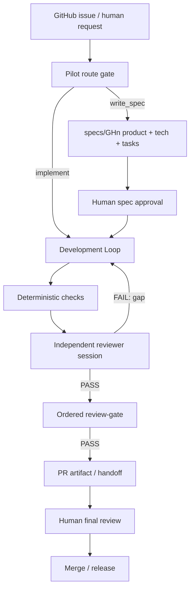

# 12 · Agent Loop 开发工作流设计

> 状态：Design。
> 目标：说明如何用 agent loop 来开发 `harness-pi`，而不是设计一个给终端用户使用的新 `/goal` 命令。
> 前置：`AGENTS.md`、`CLAUDE.md`、`AGENT_USAGE.md`、`docs/AGENT_SURFACES.md`、
> `docs/AGENT_CODING_RULES.md`、`docs/REVIEW_RUBRIC.md`、`docs/10-goal-v2-design.md`、
> `checks/review_gate.py`、`examples/05-maker-verifier-loop`、`docs/11-coding-agent-product-roadmap.md`。

## 0. 一句话

`harness-pi` 的开发 loop 应该是一个 **surface-neutral repo-aware maker-verifier loop**：

- 外层由 Pilot workflow 决定当前工作是否允许开始；
- Codex、Claude Code、generic agent runner 都读取同一套 workflow contract；
- maker session 负责读代码、改代码、跑验证；
- reviewer session 在 maker 想停时强制检查 spec、diff、测试输出和架构边界；
- deterministic gates 先判定硬事实；
- ordered review-gate 用 `/test-review` -> `/code-review` -> `/linus-review --tone=civil` 判定 PR handoff；
- human gate 保留最终 review、merge、release。

这不是把 `/goal` 包成产品命令，也不是 Codex-only 流程；它是把 `harness-pi`
自己当成 dogfood 对象，用同一套 Pilot gates + harness-pi loop primitives 开发它自己。

## 1. 为什么需要开发 loop

现在 `harness-pi` 已经有核心零件：

- `AgentSession`：执行 LLM-tool loop；
- hooks：`turnEndGuard`、`tokenBudget`、`repeatedCallGuard`、`permissionGate`、`sessionLog`、`metrics`；
- controllers：`subAgentTool`、`routedSubAgentTool`、`SubAgentRegistry`；
- adapters：`SessionStore`、NDJSON / Postgres stores、event sinks；
- dogfood app：`apps/coding-agent`；
- maker-verifier spike：`examples/05-maker-verifier-loop`。

缺的不是更多 loop 原语，而是 **把这些零件装成维护 repo 的固定流程**。

## 1.5 Surface 边界

开发 loop 必须支持至少三种入口：

| Surface | Native entrypoint | 作用 |
| --- | --- | --- |
| Codex | `AGENTS.md` | 读取 Pilot contract、选择 route、执行/验证/交接。 |
| Claude Code | `CLAUDE.md` | 读取同一 Pilot contract，再应用 harness-pi 架构规则。 |
| Generic runner | `AGENTS.md` + `AGENT_USAGE.md` | 显式加载 workflow、coding rules、rubric。 |

这些 surface 只能改变交互方式和 native hooks，不能改变：

- route gate；
- spec-first 规则；
- human gates；
- reviewer rubric；
- ordered review-gate；
- merge/release/security authority。

## 2. 两层 loop



外层是 workflow loop：issue 状态、spec packet、route gate、human gates。
内层是 execution loop：maker 改代码，reviewer 判定是否满足 spec 和 repo 架构边界。

`turnEndGuard` reviewer 和 Pilot review-gate 不是同一个东西：

- inner reviewer：每轮开发 loop 的 verifier，判断 maker 是否可以停；
- ordered review-gate：PR handoff 前的三审门，依次使用 `/test-review`、`/code-review`、`/linus-review --tone=civil`。

## 3. Development Loop 输入

每次开发 loop 应该从一个明确的 work item 开始，而不是从自由文本开始。

```ts
export interface DevelopmentWorkItem {
  issue: number;
  taskId: string;
  route: "implement" | "fix_ci" | "review_pr";
  productSpecPath?: string;
  techSpecPath?: string;
  tasksPath: string;
  allowedPaths?: string[];
  requiredCommands: string[];
  successCriteria: string[];
  humanGates: string[];
}
```

来源优先级：

1. `specs/GHn/tasks.md` 的 stable task ID；
2. `workflow.yaml` action policy；
3. `AGENTS.md` / `CLAUDE.md` surface adapters；
4. `docs/AGENT_CODING_RULES.md`；
5. `CLAUDE.md` 架构边界；
6. user message 的本轮补充。

## 4. Maker Session

maker 是真正干活的 `AgentSession`。它应该使用 `apps/coding-agent` 的能力面，而不是绕过 dogfood app 直接写专用脚本。

推荐装配：

- project instructions：自动加载 `CLAUDE.md` / `AGENTS.md`；
- tools：`read`、`grep`、`find`、`ls`、`edit`、`write`、受控 `bash`；
- hooks：`sessionLog`、`metrics`、`costTracker`、`toolStats`、`permissionGate`、`emptyRunGuard`、`repeatedCallGuard`、`tokenBudget`；
- context：work item、spec 摘要、当前 git diff、上轮 reviewer gap；
- budget：按 task 设置，而不是全局无限跑。

maker 的职责：

- 只做当前 task；
- 优先读 spec 和相关代码；
- 遵守 `docs/AGENT_CODING_RULES.md`：读再写、说明假设和权衡、保持 diff surgical；
- 修改最小必要 surface；
- 跑 required commands；
- 产出 diff、测试输出和 handoff summary。

## 5. Reviewer Session

reviewer 不是 maker 可以选择调用的工具，而是 `turnEndGuard.check` 里的强制 gate。

推荐约束：

- 独立 `AgentSession`；
- 不挂 edit/write/bash；
- 输入只给 spec、任务、diff、测试输出、相关架构摘录；
- 输出协议固定为 `PASS` 或 `FAIL: <one-line gap>`；
- provider 失败、超时、非 `done` 终态必须作为 gate error 上报，不能伪装成普通 FAIL。

reviewer rubric：

- 是否满足 `product.md` 的验收标准；
- 是否符合 `tech.md` 的设计边界；
- 是否完成 `tasks.md` 的目标 task；
- 是否符合 `docs/REVIEW_RUBRIC.md`；
- 是否保持 `CLAUDE.md` 的核心不变量；
- 是否存在 Codex-only / Claude-Code-only 的 policy drift；
- 是否跑了 required commands；
- 是否越权修改了非目标 surface；
- 是否遗漏测试或文档。

## 6. Deterministic Gates 先于 Reviewer

LLM reviewer 不负责判定机器已经能确定的事实。

开发 loop 在进入 reviewer 前先跑：

```bash
python3 checks/check_workflow.py --repo . --all-specs
python3 checks/route_gate.py --repo . --route implement --issue <n> --state ready_to_implement
pnpm -r build
pnpm -r typecheck
pnpm -r test
```

按任务 scope 可以收窄到单包命令，但最终 handoff 必须说明跑了什么、没跑什么。

## 6.5 Ordered Review-Gate 先于 Human Final Review

当 development loop 产出 PR handoff 时，再进入 Pilot review-gate：

```bash
/test-review
/code-review
/linus-review --tone=civil
python3 checks/review_gate.py --repo . --evidence review/PR<pr-number>/review-gate.json
```

`workflow.yaml.review_gate` 是唯一规则源：stage 顺序、required conditions、
pass conditions 和 blocking ratings 都从这里读取。三审门失败时，agent 不应
把工作交给 human final review，除非人类显式 override。

这个 gate 仍然不拥有 merge 权限。它只是把“agent 自己觉得做完了”变成可检查的 review evidence。

## 7. Loop 终止矩阵

| 条件 | 结果 | 后续 |
| --- | --- | --- |
| deterministic check 失败 | maker 继续 | 回灌失败命令和关键输出 |
| reviewer `FAIL` | maker 继续 | 回灌 one-line gap |
| reviewer `PASS` + checks 绿 | loop 完成 | 生成 handoff / PR artifact |
| ordered review-gate 失败 | handoff blocked | 修复或请求 human override |
| reviewer gate error | loop 不可信 | 停止并交给人 |
| token budget exhausted | bounded stop | 汇报剩余 gap |
| repeated-call guard 熔断 | bounded stop | 汇报重复模式 |
| human gate required | 停止 | 请求 spec approval / final review / merge |

## 8. 不变量

- 不把能力塞进 `@harness-pi/core`：开发 loop 是 app / recipe / example 层装配。
- 不让 maker 自报完成：完成由 reviewer + deterministic gates 判断。
- 不让 reviewer 改代码：reviewer 是判定者，不是第二个 maker。
- 不把 inner reviewer 当成 PR review-gate：三审门仍然要产出 `review-gate.json`。
- 不自动 merge：merge 仍是 human gate。
- 不用 chat history 当 durable state：以 spec packet、git diff、CI、review artifact 为准。
- 不让 Codex、Claude Code 或任一 surface 拥有独立 workflow policy。
- 不要求一次做成产品命令：先做 repo 开发 recipe，再决定是否封装 CLI。

## 9. 建议落点

第一阶段不要改内核，新增一个 recipe / example 即可：

```text
examples/06-repo-development-loop/
  src/development-loop.ts
  src/index.ts
```

或放在 dogfood app 的内部模块：

```text
apps/coding-agent/src/dev-loop/
  work-item.ts
  maker.ts
  reviewer.ts
  run-development-loop.ts
```

推荐先用 `examples/06-repo-development-loop`，原因是它不会把尚未稳定的开发流程承诺成产品 API。

## 10. 最小实现路线

1. **Offline recipe**
   - 使用 fake model 跑通 maker → reviewer FAIL → maker 修复 → reviewer PASS。
   - 不接真实 repo 写入。

2. **Harness-pi self-dogfood**
   - 读取 `specs/GHn/tasks.md` 生成 `DevelopmentWorkItem`。
   - 在临时 fixture repo 或小 docs task 上跑。

3. **Real repo guarded run**
   - 允许 maker 改当前 worktree。
   - reviewer 只读。
   - required commands 可配置。

4. **PR handoff**
   - 输出 PR summary、verification、residual risk、human gates。
   - 不自动 merge。

5. **Promotion decision**
   - 如果 recipe 被重复使用，再考虑升为 `apps/coding-agent` 的内部 dev-loop 模块或 CLI command。

## 11. 与现有 `/goal` 的关系

`/goal` 是用户输入一个目标，让 coding-agent 尝试推进。
开发 loop 是维护 repo 的工程流程，它的输入不是一句目标，而是 spec packet + work item + gate policy。

因此开发 loop 可以复用 `/goal` v2 的 maker-verifier 结构，但不应复用 v1 的 `GOAL_STATUS` 自报协议。

## 12. 成功标准

一个 `harness-pi` task 可以这样跑完：

1. route gate 确认允许 implement；
2. maker 完成 scoped diff；
3. deterministic checks 通过；
4. reviewer 独立 PASS；
5. `/test-review`、`/code-review`、`/linus-review --tone=civil` review-gate 通过；
6. 输出 handoff；
7. 人类 final review 后再 merge。

当这个流程能在 3 个真实小任务上稳定跑通，再考虑把它产品化。
